## Universidad de Costa Rica 
## Modelos Probabilísticos de Señales y Sistemas
# Tarea 4: Álvaro Alfaro Miranda - B70224

1. Modulación BPSK para los bits presentados.

La modulación BPSK se hizo con las siguientes funciones:

sin (2*pi*f*t) si el bit es un 1

-sin(2*pi*f*t) si el bit es un 0

La siguiente figura muestra la modulación para los primeros 5 bits.

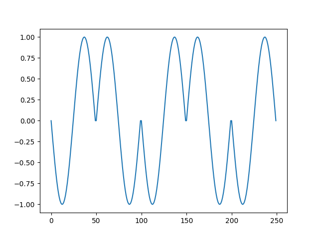

Los primeros 5 bits son: 0, 1, 0, 1, 0

2. Potencia promedio de la señal modulada generada.

La potencia promedio de la señal modulada es 0,49 W.

3. Canal ruidoso del tipo AWGN (ruido aditivo blanco gaussiano) con una relación señal a ruido (SNR) desde -2 hasta 3 dB.

A continuación se muestra la señal, de los 5 primeros bits, producida por el AWGN.

Para un SNR = -2 dB

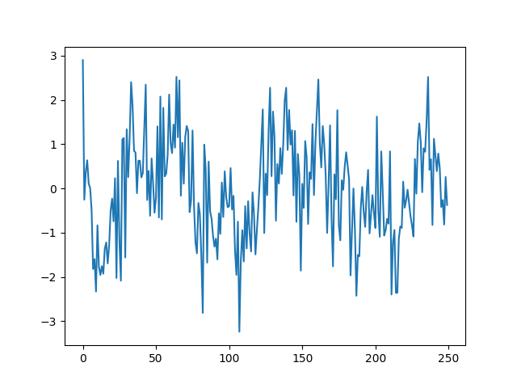

Para un SNR = -1dB

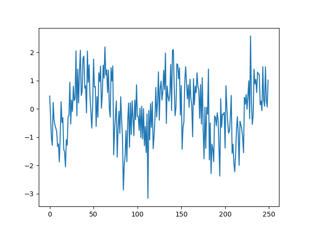

Para un SNR = 0 dB

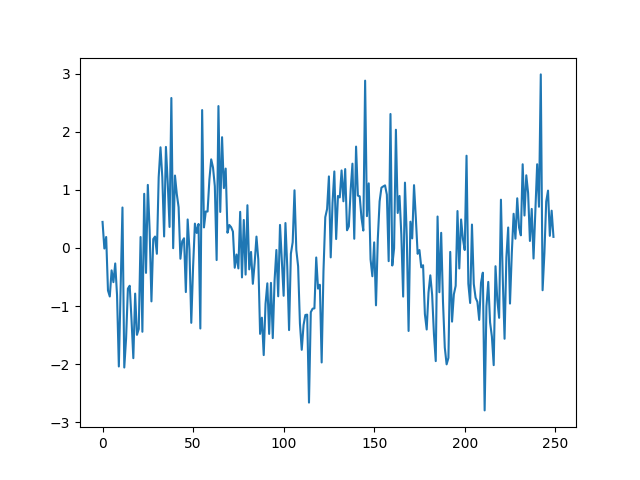

Para un SNR = 1 dB

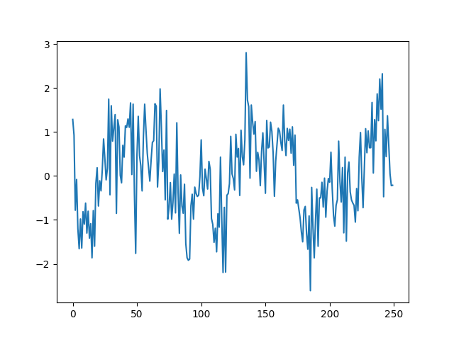

Para un SNR = 2 dB

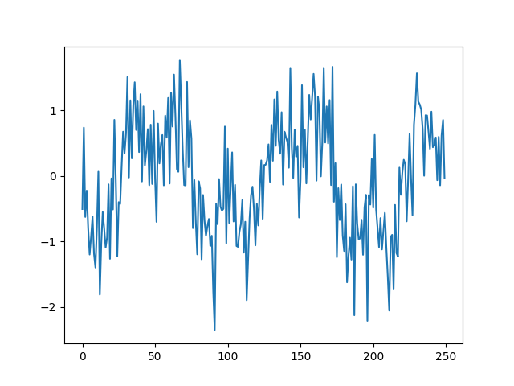

Para un SNR = 3 dB

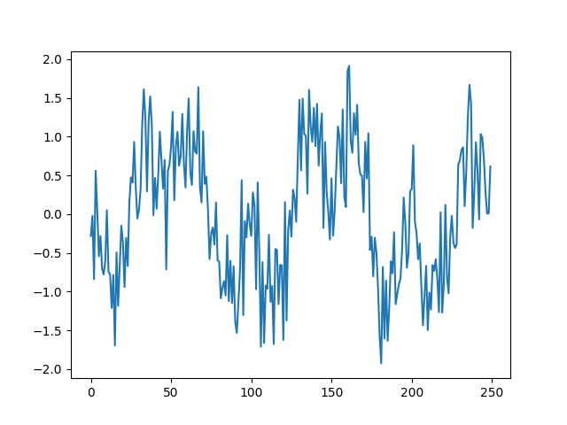

4. Gráfica de la densidad espectral de potencia de la señal con el método de Welch (SciPy), antes y después del canal ruidoso.

A continuación se muestra la gráfica de la densidad espectral de potencia de la señal antes del canal ruidoso.

A continuación se muestra las gráficas de la densidad espectral de potencia de la señal después del canal ruidoso, para cada SNR.

Para un SNR = -2 dB

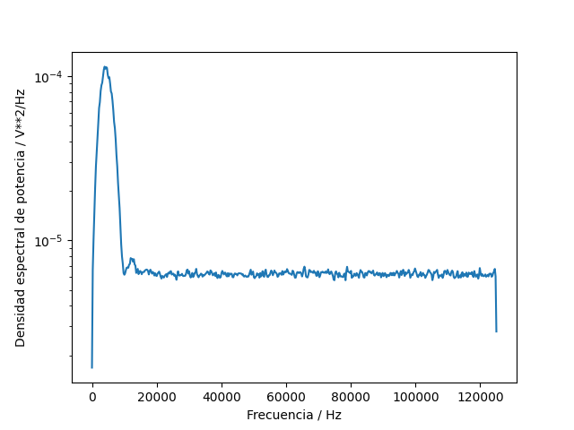

Para un SNR = -1 dB

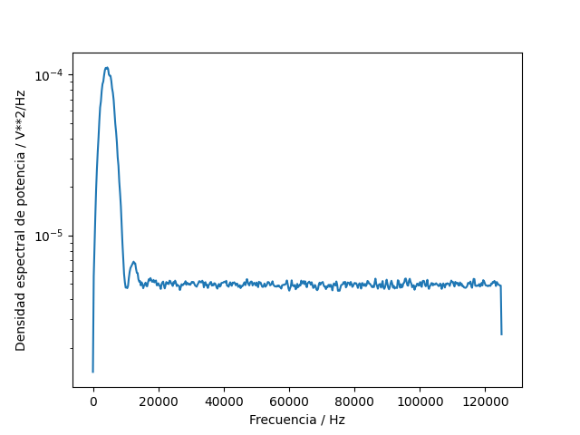

Para un SNR = 0 dB

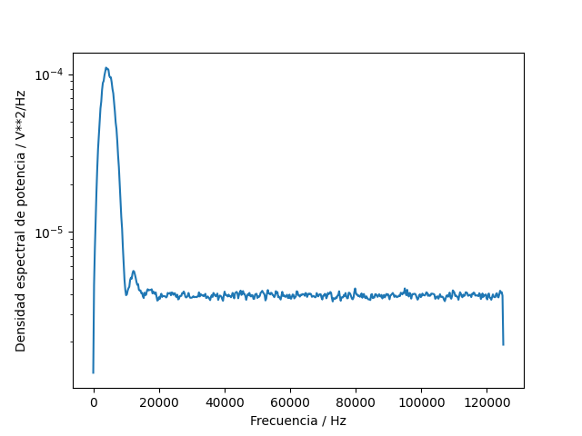

Para un SNR = 1 dB

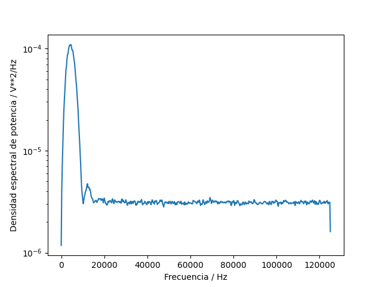

Para un SNR = 2 dB

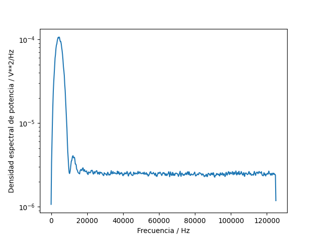

Para un SNR = 3 dB

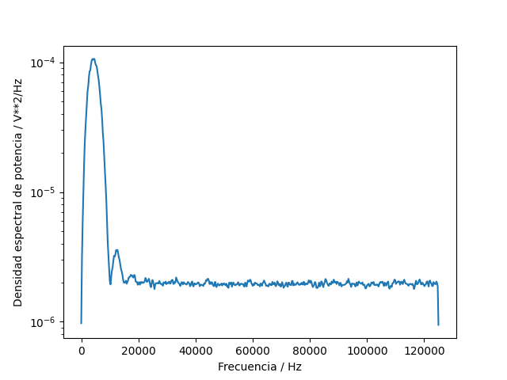

5. Demodulación y decodificación de la señal y conteo de la tasa de error de bits (BER, bit error rate) para cada nivel SNR.

| SNR | Cantidad de errores | Tasa de error de bits (BER) | 
| ------ | ---- | ---- |
| -2 | 11 | 0,0011  |
| -1 | 3 | 0,0003 |
| 0 | 1  | 0,0001  |
| 1 | 1  | 0,0001 |
| 2 | 0  | 0 |
| 3 | 0  | 0 |

6. Gráfica BER versus SNR.

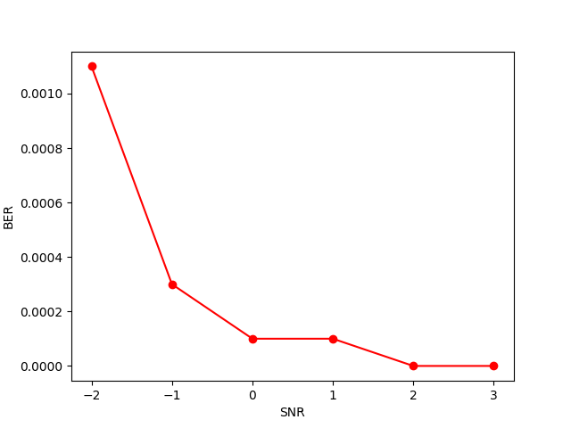

